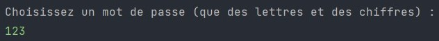
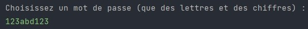
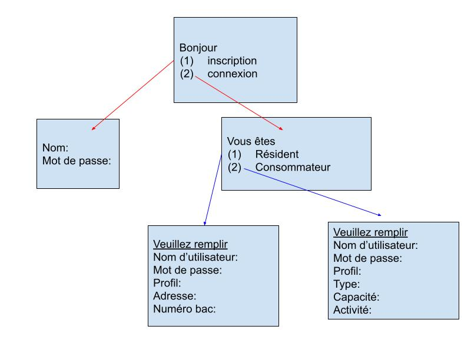
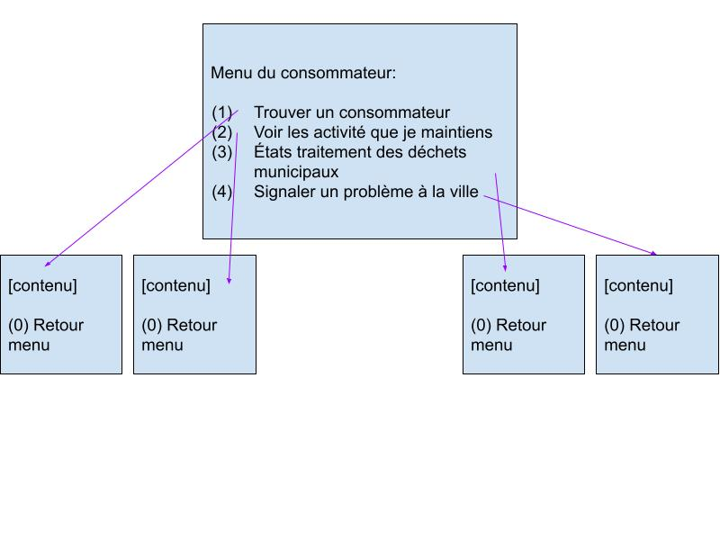
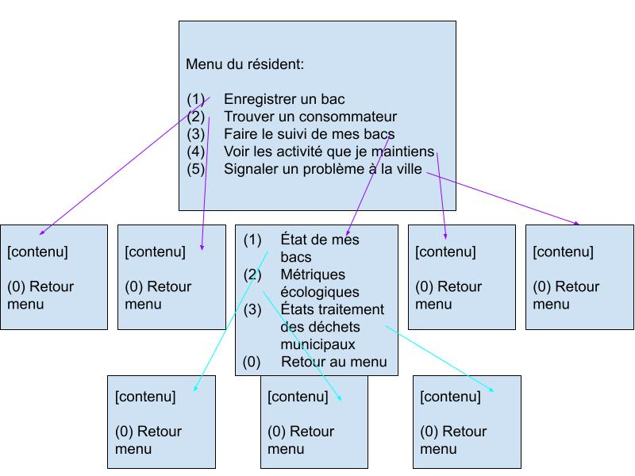

<!--- inspirer de https://gist.githubusercontent.com/JulienRAVIA/1cc6589cbf880d380a5bb574baa38811/raw/4b124956b45d4bdacf338da137e9c53b392f1560/README-Template.md) --->

# Outil BINECO

--**POUR EXECUTER L'APPLICATION SIMPLEMENT RUN LA FONCITON MAIN DANS LA BRANCHE MAIN!**--

----
## IMPORTANT
> *Comme seul le nom d’utilisateur et son mot de passe respectif seront sauvegardés, le prototype ne vérifie pas la validité du courriel, téléphone, etc.*

> *Ne pas mettre d'espace dans le nom d'utilisateur

> *Si on arrive pas à quitter la session avec "99" , il faut stopper manuelement le code (Sign in et Log in) et vider les fichiers passConsommateur.txt et passResident.txt.

Toujours quitter l'application par le input 99, sinon les fichiers contenant les informations de connection ne sont pas effacés et cela pourrait creer des problemes pour les connections suivantes!

Le prototype ne gere qu'un seul enregistrement en ce moment donc ne pas creer plusieurs compte. Simplement creer un compte et se connecter a celui ci immediatement.

--- 

## À NOTER :
Lorsqu'on recherche des bacs, des consommateurs ou des lots, utiliser les numeros/codes définies ci dessous. Ce sont les données que nous avons générées!

	
### Pour les bacs :
	
Numero des bacs existant (emis par la ville)
- *numerosBac* = {"r00", "r01","r02","d00","d01","d02","co00","co01","co02"}

Informations sur ces bacs (Hash Map) -> (code , {adresse, date emission})

### Pour les consommateurs :

Code des consommateurs existant
- *listeCons* = {"c00","c01","c02","c03","c04","c05","c06","c07","c08","c09"}

Code des consommateurs disponibles au signUp
- *listeConsDispo* = {"c10","c11","c12","c13","c14","c15","c16","c17","c18","c19"}

Information sur les consommateurs (Hash Map) -> (code, {activité1:capacité, activité2:capacité}
- Noter qu'un consommateur peut avoir de 1 a 3 activités

### Pour les lots :
	
Liste des lots existants (premier caractere est L, pas 1)
- *listeLots* = {"l00","l01","l02","l03","l04","l05","l06","l07","l08","l09"}
    
----
## Instructions

À chaque fois que vous exécuter le programme,
### 1. S'inscrire à la page Sign In en tant que résident ou consommateur
```
Resident :
		-Enregistrement du bac : numeros valide sont r00,r01,r02,d00,d01,d02,co00,co01,co02
		-Si le numero ne correspond pas on vous demande de re entrer le numero

Consommateur :
		-Code : les codes valides seront c10,c11......c19.
		-Les codes c00...c09 sont 'deja enregistrés' dans notre systeme (fausses donnees)
```
### 2. Entrer vos informations:
1. **Important:** VOTRE MOT DE PASSE DOIT CONTENIR DES *LETTRES* **ET** DES *CHIFFRES*

   - Non valide:

    
    .jpg)
    .jpg)

   - Valide:

    
### 3. Se connecter avec le ***même*** nom d'utilisateur et mot de passe. 
Si les infos ne correspondent pas, on revoie le formulaire de connection
### 4. Choisir les options menus.
   - À NOTER:
        ```
        MENU RESIDENT: 
            **Appuyer sur 0 pour revenir au MENU a tout moment (apres les formulaires).
            -Au bas de la page sont vos bacs deja enregistrés


        MENU CONSOMMATEUR :
            -Moins de fonctionnalités puisque il n'y en avait pas vraiment de définies.

        ```
    
### 5. *Quitter le programme en appuyer 99*.
---
## Échéancier


---
## Site mapping




---
## Auteurs

- Kim Trinh (20215539)
- Xavier Laperriere (20157146)
- Eed Flory Jean-Baptiste (20168335)
- Miliya Ai (20180783)


